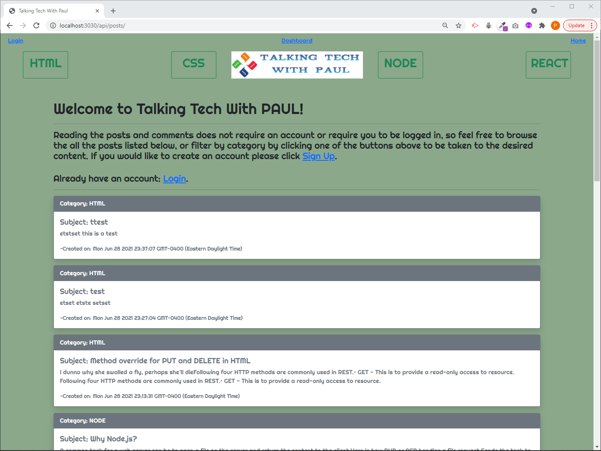
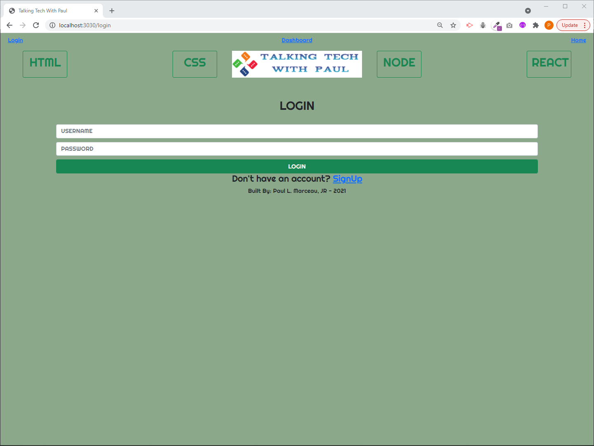
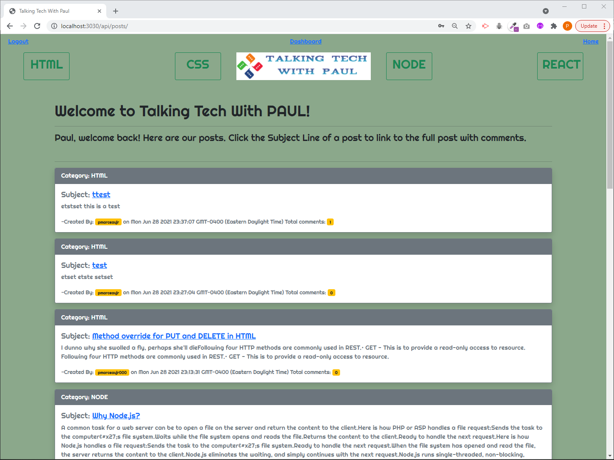
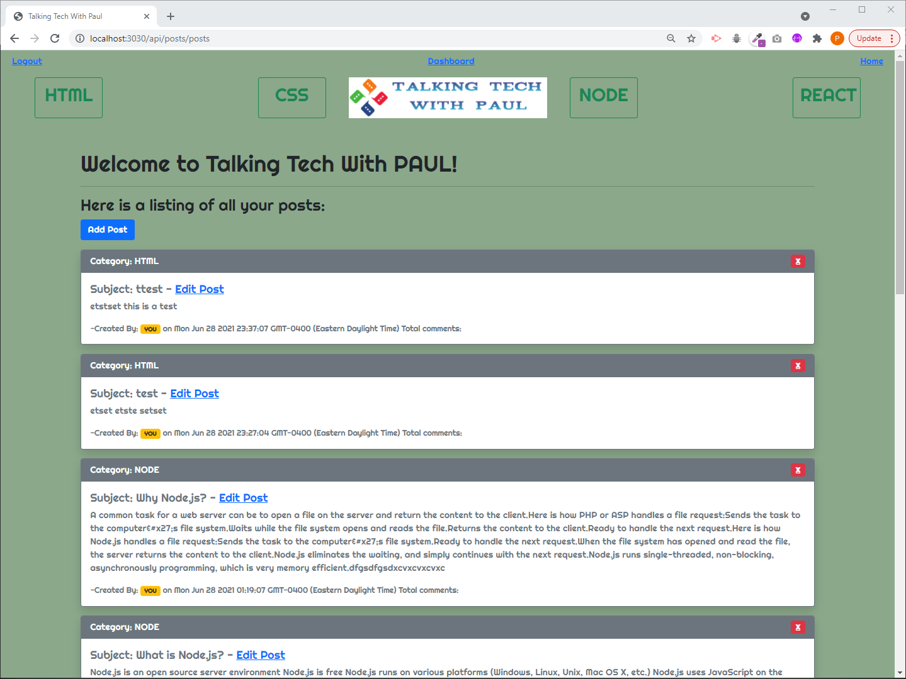

# **Model-View-Controller (MVC): Tech Blog**

## **Description**

Writing about tech can be just as important as making it. Developers spend plenty of time creating new applications and debugging existing codebases, but most developers also spend at least some of their time reading and writing about technical concepts, recent advancements, and new technologies. A simple Google search for any concept related to WebDev returns thousands of think pieces and tutorials from developers of all skill levels!  My project is to build a CMS-style blog site similar to a Wordpress site, where developers can publish their blog posts and comment on other developers’ posts as well. I’ll build this site completely from scratch and deploy it to Heroku. This app will follow the MVC paradigm in its architectural structure, using Handlebars.js as the templating language, Sequelize as the ORM, and the express-session npm package for authentication.

## Table of Contents

- [User Story](#user-story)
- [Acceptance Criteria](#acceptance-criteria)
- [Installation](#installation)
- [Usage](#usage)
- [Required](#required)
- [Testing](#testing)
- [Questions And Support](#questions-and-support)
- [Contributors](#contributors)
- [Deployed Link](#deployed-link)
- [Media Links](#media-links)
- [License](#license)

---

## **User** **Story**

AS A developer who writes about tech I WANT a CMS-style blog site SO THAT I can publish articles, blog posts, and my thoughts and opinions

## **Acceptance** **Criteria**

GIVEN a CMS-style blog site WHEN I visit the site for the first time THEN I am presented with the homepage, which includes existing blog posts if any have been posted; navigation links for the homepage and the dashboard; and the option to log in WHEN I click on the homepage option THEN I am taken to the homepage WHEN I click on any other links in the navigation THEN I am prompted to either sign up or sign in WHEN I choose to sign up THEN I am prompted to create a username and password WHEN I click on the sign-up button THEN my user credentials are saved and I am logged into the site WHEN I revisit the site at a later time and choose to sign in THEN I am prompted to enter my username and password WHEN I am signed in to the site THEN I see navigation links for the homepage, the dashboard, and the option to log out WHEN I click on the homepage option in the navigation THEN I am taken to the homepage and presented with existing blog posts that include the post title and the date created WHEN I click on an existing blog post THEN I am presented with the post title, contents, post creator’s username, and date created for that post and have the option to leave a comment WHEN I enter a comment and click on the submit button while signed in THEN the comment is saved and the post is updated to display the comment, the comment creator’s username, and the date created WHEN I click on the dashboard option in the navigation THEN I am taken to the dashboard and presented with any blog posts I have already created and the option to add a new blog post WHEN I click on the button to add a new blog post THEN I am prompted to enter both a title and contents for my blog post WHEN I click on the button to create a new blog post THEN the title and contents of my post are saved and I am taken back to an updated dashboard with my new blog post WHEN I click on one of my existing posts in the dashboard THEN I am able to delete or update my post and taken back to an updated dashboard WHEN I click on the logout option in the navigation THEN I am signed out of the site WHEN I am idle on the site for more than a set time THEN I am able to view comments but I am prompted to log in again before I can add, update, or delete comments

## **Installation**

- Steps to install The Application Locally  + Install Node.js  + Clone repository to your local machine  + Run "npm install" to install all dependencies  + Open MYSQL workbench and execute the schema  + Type "node seeds/index.js" on the root to seed the tables  + Type "node server.js" on the root to run the application   # The application is deployed to heroku: https://pmarceaujr-tech-blog-51213dd540bd.herokuapp.com/api/posts/

## **Usage**

- Using The Application  + You will land on the homepage, this is a basic listing of all posts.  + If you have an account you can login if you don't you can signup  + Once you are logged in you can see more detail for each post.  + You can click a post Subject and link to the comments on the post  + You can click the dashborad to see all your posts, edit or click the RED X at the right of the post to delete it.  + You can use the buttons at the top to filter the posts by topic.  + Clicking logout will log you out

## **Media** **Links**

## Landingpage, not logged in:

## Login Page:

## Landingpage, logged in:

## User dashboard:

## **Required**

Reauirements are built into the npm package.json file

## **Testing**

All testing was done to ensure that the acceptance criteria were met accordingly

## **Questions** **And** **Support**

If you have any questions about the application or the repository, please open an [issue](https://github.com/pmarceaujr/CMS-StyleBlogSite/issues) or contact me via email at paul@themarceaus.net.  
 You can find more of my work on my [GitHub](https://github.com/pmarceaujr).

## **Contributors**

No other contributors at this time

## **Deployed** **Link**

[Hosted on Heroku](https://pmarceaujr-tech-blog-51213dd540bd.herokuapp.com/api/posts/)

## **License**

This project is licensed under the [MIT License](https://choosealicense.com/licenses/mit).
